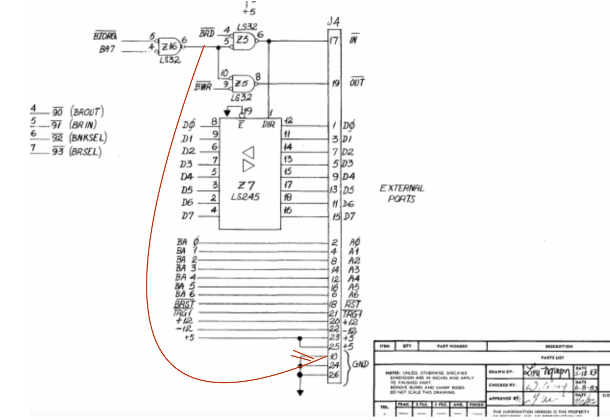
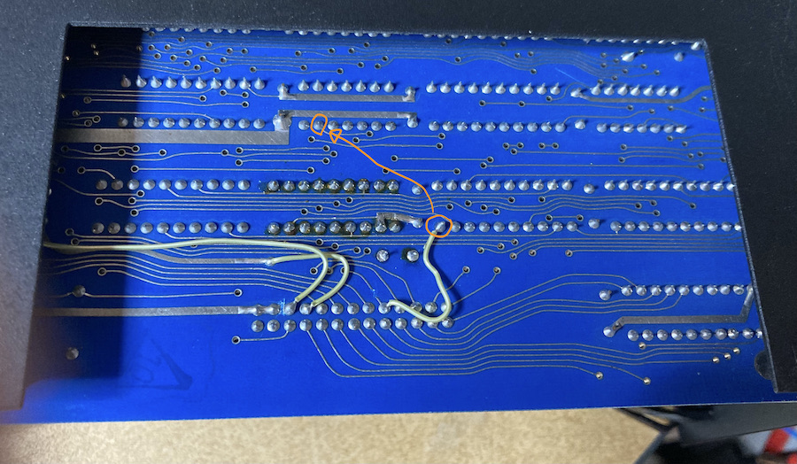
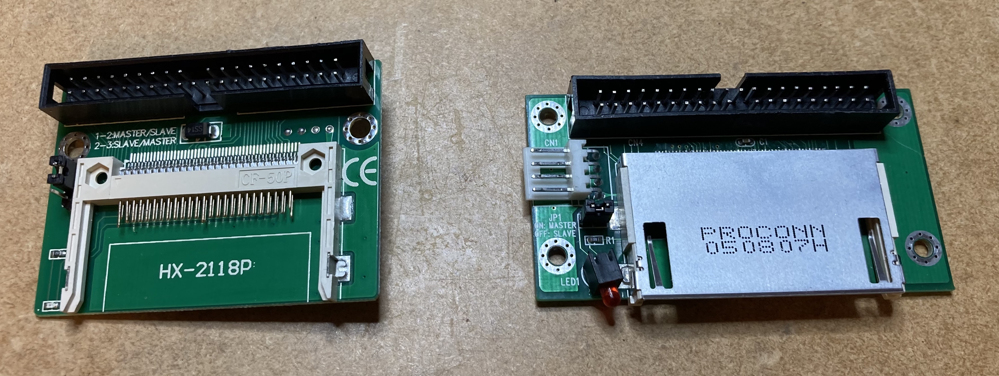
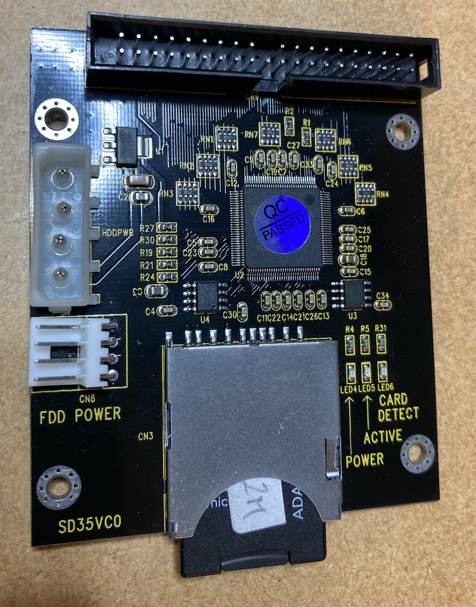

# Micromate hardware mods

The Micromate hardware reference manual is available here:
[MicroMate PMC 101 Technical Manual Aug83 pdf](https://1library.net/document/z3dwn59y-micromate-pmc-technical-manual-aug-pdf.html)

## The mod
The following clip from the schematics shows the unused I/O port which turns out to work fine for IDE-card/CF/SD-cards. 

The mod (red) is required because there is no /CS signal to send to the IDE interface to indicate `drive selected`. We create such signal by connecting the output from Z16/P6 which is basically the Chip Select signal to the LS245 buffer chip (/BIORQ+A7 NAND), to pin 10 on the 26 pin header. See the PCB photo for details.

The next challenge is to create a cable with the appropriate connections. My prototype looks messy - and has taken quite a few beatings along the way, but still works. BTW - make sure you cut a somewhat longer cable than this, although not excessively long in case you want to hide the device inside the chassis later. 

The connections are listed in the table below. Note the pull-up resistors, possibly not required but a cheap insurance against possible (and obscure) problems. I chose 1.5 Kohm resistors, anything from 500ohms to 3 Kohm should be fine. For reference and comparison, this schematic is useful: [Z80 CPM SBC Version C - REV D](https://easyeda.com/peabody1929/CPM_Z80_Board_REV_B_copy-76313012f79945d3b8b9d3047368abf7)

## IDE adapter
Any IDE drive may be connected to the cable, but there may not be enough power to drive them. I have only used CF- and SD cards.
Further, I have not been able to get CF-cards to work well with this setup. It turns out that certain datapatterns will disturb the write operation and send garbage data (various number of NULLS) to the device, replacing the real data. Read more about this in the CFinit-program docs. The CFinit-program has a special test for this. SD-card adapters work fine.

CF-cards - no success.

SD-cards - success

I managed to pull the ribbon cable through the printer port opening in the back of the Micromate. Convenient, at least while testing, and in case you want to have access to the card - to move data back and forth.

## Testing
Cable ready and device plugged in, you're ready to test. Most IDE adapters have LEDs for alt least activity, so keep and eye on that when doing the first tests. Fire up the Micromate and run the CFinit program. The activity LDE should emit a short blink just after program load. If it does, you're almost there. If the data printed any the program, make sense, you're ready to pop the cork.

